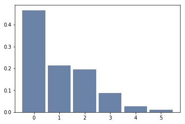
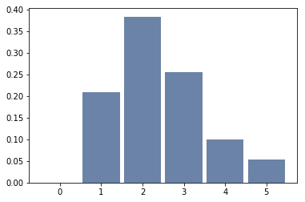

[Think Stats Chapter 3 Exercise 1](http://greenteapress.com/thinkstats2/html/thinkstats2004.html#toc31) (actual vs. biased)

```python
import probability
import thinkstats2
import nsfg
```


```python
resp = nsfg.ReadFemResp()
```


```python
pmf = thinkstats2.Pmf(resp.numkdhh, label='actual')
thinkplot.Hist(pmf)
```





```python
pmf_biased = probability.BiasPmf(pmf, label='biased')
thinkplot.Hist(pmf_biased)
```





```python
print('Unbiased mean: {} \nBiased mean: {}'.format(pmf.Mean(), pmf_biased.Mean()))
```

    Unbiased mean: 1.024205155043831
    Biased mean: 2.403679100664282
