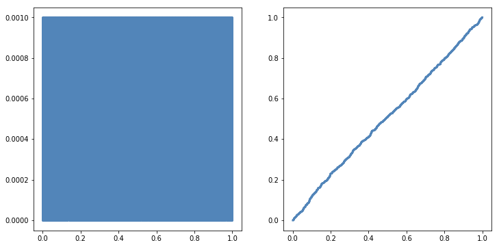

[Think Stats Chapter 4 Exercise 2](http://greenteapress.com/thinkstats2/html/thinkstats2005.html#toc41) (a random distribution)

```python
import thinkstats2
import thinkplot
from random import random
```


```python
nums = [random() for x in range(1000)]

pmf = thinkstats2.Pmf(nums, label='pmf')
cdf = thinkstats2.Cdf(nums, label='cdf')
```


```python
thinkplot.PrePlot(2, cols=2)

thinkplot.Pmf(pmf)

thinkplot.PrePlot(2)
thinkplot.SubPlot(2)
thinkplot.Cdf(cdf);
```





Looks like `random.random()` is doing a great job of producing random numbers between 0 and 1. We'd expect a baseline probability of .001 for all numbers, and a perfectly linear CDF, which is exactly what we observe.
