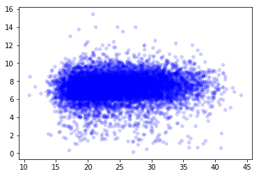
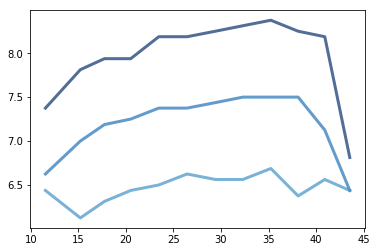

[Think Stats Chapter 7 Exercise 1](http://greenteapress.com/thinkstats2/html/thinkstats2008.html#toc70) (weight vs. age)

```python
import first
import thinkstats2
import thinkplot

preg, firsts, others = first.MakeFrames()
```


```python
preg = preg.dropna(subset=['agepreg', 'totalwgt_lb'])
```


```python
thinkplot.scatter(xs = preg.agepreg, ys = preg.totalwgt_lb)
```





We need to bin the mother's ages before we plot birth weight percentiles:


```python
bins = np.arange(10, 45, 3) # Create bins of mother's age
indices = np.digitize(preg.agepreg, bins) # Create x indices for our plot
groups = preg.groupby(indices) # Group our dataframe by our x indices
```

For each group (bin) of mothers' ages, we compute the mean age of mothers and the CDF of their childrens' birth weights.


```python
ages = [group.agepreg.mean() for i, group in groups]
cdfs = [thinkstats2.Cdf(group.totalwgt_lb) for i, group in groups]
```

Now we're ready to plot the percentiles of birth weight vs mother's age.


```python
for percent in [75, 50, 25]:
    weights = [cdf.Percentile(percent) for cdf in cdfs]
    thinkplot.Plot(ages, weights)
```





Now let's calculate the Pearson's and Spearman's correlations:


```python
ages = preg.agepreg
weights = preg.totalwgt_lb

print('Pearson\'s correlation: {}'.format(thinkstats2.Corr(ages, weights)))
print('Spearman\'s correlation: {}'.format(thinkstats2.SpearmanCorr(ages, weights)))
```

    Pearson's correlation: 0.06883397035410908
    Spearman's correlation: 0.09461004109658226


There doesn't appear to be much correlation between mother's age and birth weight, save for mothers in their mid 40s. The correlation coefficients are both below .1. The percentile graphs look somewhat parabolic, making me think this relationship might be non-linear. The percentile graphs might also support the possibility of a bilinear relationship.
