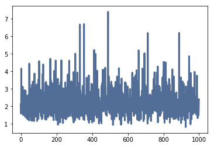
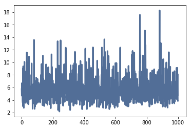
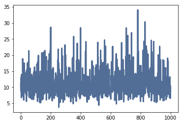
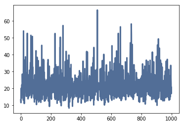

[Think Stats Chapter 8 Exercise 2](http://greenteapress.com/thinkstats2/html/thinkstats2009.html#toc77) (scoring)

First create our sampling distribution:


```python
import math

def exp_sampling_distribution(lam=2, n=10, iters=1000):
    '''
    Plots a sampling distribution of the estimator L of an exponential distribution.
    Prints the standard error and confidence interval of L.
    ------------
    Parameters:
    lam, scale of exponential distribution
    n, number of exponentially generated values per iteration
    iters, number of ls generated
    '''

    ls = [1/np.random.exponential(scale=1/lam, size = 10).mean() for _ in range(iters)]
    ls = np.array(ls)

    cdf = thinkstats2.Cdf(ls)
    percentile5 = cdf.Percentile(5)
    percentile95 = cdf.Percentile(95)

    thinkplot.plot(ls)

    print('Standard error: {}'.format(ls.std() / math.sqrt(iters)))
    print('Confidence interval: ({}, {})'.format(percentile5, percentile95))
```


```python
exp_sampling_distribution()
```

    Standard error: 0.025512157005095872
    Confidence interval: (1.2549911567950407, 3.7485208383898927)





Let's try with lambdas of 5, 10, and 20:


```python
exp_sampling_distribution(lam=5)
```

    Standard error: 0.06517042737629214
    Confidence interval: (3.280379718551429, 9.688975095399309)





```python
exp_sampling_distribution(lam=10)
```

    Standard error: 0.1273922987393487
    Confidence interval: (6.302887360397886, 19.48512891052764)





```python
exp_sampling_distribution(lam=20)
```

    Standard error: 0.237835877704008
    Confidence interval: (13.138354125016795, 36.08819826146267)





Seems like standard error and confidence interval scale up with different lambda values.
