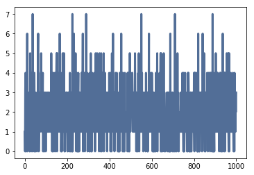

[Think Stats Chapter 8 Exercise 3](http://greenteapress.com/thinkstats2/html/thinkstats2009.html#toc77)

---

```python
import estimation
import thinkstats2
import thinkplot
```

We'll need to plot some horizontal lines to show our 90% confidence interval later. We'll need to define a function for that.


```python
def simulate_game(lam):
    t = 0
    goals = 0

    while t < 1:
        t += np.random.exponential(scale=1/lam)

        if t >= 1:
            break

        goals += 1

    return goals
```


```python
def simulate_n_games(lam, iters=1000):
    ls = [simulate_game(lam) for _ in range(iters)]

    ls = np.array(ls)

    meanerr = estimation.MeanError(ls, lam)
    rmse = estimation.RMSE(ls, lam)

    print('Mean error of goal scoring estimation: {}'.format(meanerr))
    print('Root mean squared error of goal scoring estimation: {}'.format(rmse))

    cdf = thinkstats2.Cdf(ls)

    percentile5 =  cdf.Percentile(5)
    percentile95 = cdf.Percentile(95)

    print('90% confidence interval: ({}, {})'.format(percentile5, percentile95))
    print('Standard error: {}'.format(ls.std()/math.sqrt(iters)))


    thinkplot.plot(ls)
```


```python
simulate_n_games(2)
```

    Mean error of goal scoring estimation: -0.013
    Root mean squared error of goal scoring estimation: 1.418097316829843
    90% confidence interval: (0, 4)
    Standard error: 0.044842290307253486





Let's test if this estimator is unbiased by running a few game simulations with different numbers of iterations:


```python
for _ in range(1, 4):
    simulate_n_games(lam=2, iters=10**_)
```

    Mean error of goal scoring estimation: -0.6
    Root mean squared error of goal scoring estimation: 1.61245154965971
    1.4
    Mean error of goal scoring estimation: 0.09
    Root mean squared error of goal scoring estimation: 1.5
    2.09
    Mean error of goal scoring estimation: -0.01
    Root mean squared error of goal scoring estimation: 1.4120906486483082
    1.99


The mean error of our estimator is small and appears to be decreasing as we increase the number of iterations. This is not a rigorous proof of the estimator being unbiased but it does suggest that our estimator is probably unbiased.

---
